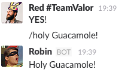

# holy-ward-slack
Connect this bot with your Slack team and you’ll have 1960’s Robin’s catch-phrases
at the tip of your fingers! Just send a `/holy` slash command.

Inspired by the [numerous _“Holy…”_ exclamations](https://en.wikipedia.org/wiki/List_of_exclamations_by_Robin)
said by [Burt Ward](https://en.wikipedia.org/wiki/Burt_Ward) during his time
playing Robin for the [Batman](https://en.wikipedia.org/wiki/Batman_(TV_series))
TV series, this is supposed to be a simple project to add some _pzaz_ to your
Slack.

## Instructions
1. Set a new slash command  
Go [here](https://<your-team-name>.slack.com/apps/manage/custom-integrations),
click _Slash Commands_, click _Add Configuration_, and fill up the details.
1. Make sure you set up the correct environment variables  
Look at `.env.example.json` to see the varialbes I use on this app.
`TOKEN` is the most important one, it’s the token Slack provides for your
custom slash command.
1. Deploy this Node.js app somewhere  
Heroku or other service is fine, as long as you have a link at the end you can
point Slack to on the custom slash command page (the command needs to make a
POST request to `<your-link>/slack/receive`).
1. That’s basically it. Hit me on [Twitter](https://twitter.com/gnclmorais)
if you have any questions.

## Result
You’ll have something like this:  

For bonus impact, you can pass you custom _Holy…_ message by writing
`/holy <your-message>`:  

## From the TV series
- [_Holy smoke!_](http://25.media.tumblr.com/tumblr_maz2d1tKZf1rtwv7zo3_250.gif)
- [_Holy ashtray!_](https://metrouk2.files.wordpress.com/2016/01/tumblr_maz2d1tkzf1rtwv7zo1_250.gif)
- [_Holy popcorn!_](http://24.media.tumblr.com/tumblr_maz2d1tKZf1rtwv7zo10_r1_250.gif)
- [_Holy rainbow!_](http://25.media.tumblr.com/tumblr_maz2d1tKZf1rtwv7zo12_r1_250.gif)
- [_Holy sardine!_](http://25.media.tumblr.com/5d2ab4f2ccf5a7dc54f82b1fc5665897/tumblr_msogp3Sxir1saaejco6_250.gif)
- [_Holy fruit salad!_](http://24.media.tumblr.com/tumblr_m0lr3cHFRS1qdkb9oo6_r1_250.gif)
- [_Holy haberdashery!_](https://66.media.tumblr.com/a3758be153d80b266456d3fc71f48e35/tumblr_nu1lwty9041u4sv3qo2_250.gif)
